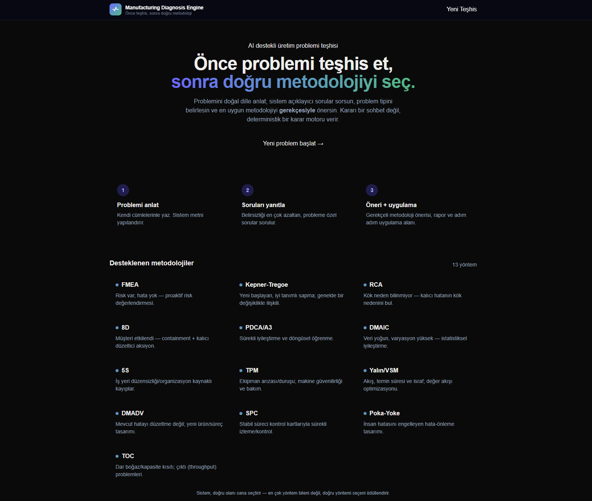
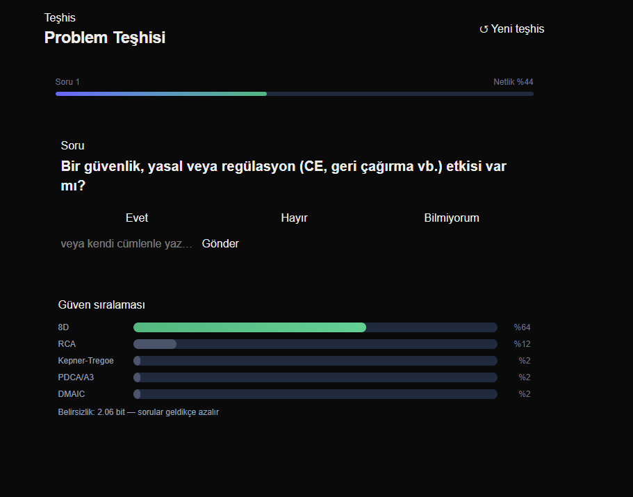
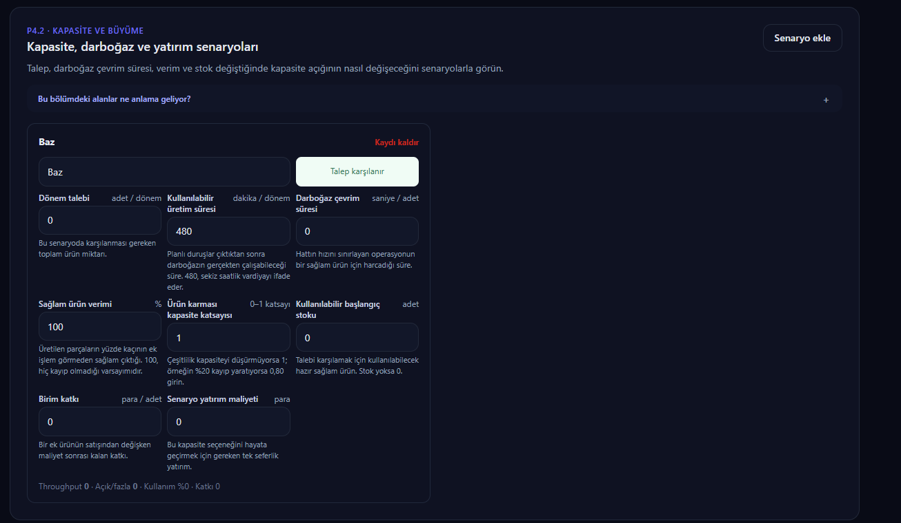
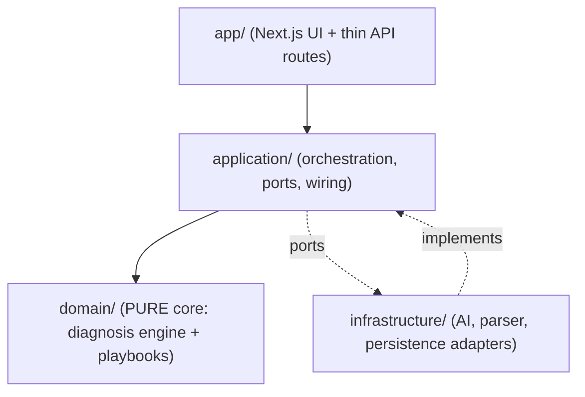

# Manufacturing Decision Engine (MDE)

> **Önce problemi teşhis et, sonra doğru metodolojiyi seç.**
> *Diagnose the problem first, then pick the right methodology.*

AI-assisted decision-support tool for manufacturing & quality teams. It does **not** just
fill in a methodology template — it first *diagnoses* the problem, recommends the correct
methodology **with justification** (FMEA / KT / RCA / 8D / PDCA / DMAIC / SPC …), then guides
the team through end-to-end execution.

The key design choice: **the decision is made by a pure, deterministic domain engine — not by
the LLM.** The language model is used only for *understanding* free text, *asking* natural
questions and *writing* reports. This makes every recommendation explainable and reproducible.

**🔗 Live demo:** **[manufacturingdecisionengine.com](https://www.manufacturingdecisionengine.com)**
· deployment notes: [`docs/DEPLOY_VERCEL.md`](docs/DEPLOY_VERCEL.md)



**Not:** Türkçe açıklama için [aşağıya](#türkçe) inin.

---

## English

### Why this is interesting

Most "AI + manufacturing" demos pipe a prompt into an LLM and trust the answer. This project
does the opposite: it treats methodology selection as a **classification problem over a
declarative rule base**, and uses the LLM only at the edges.

- **Deterministic decision engine** — `src/domain/diagnosis/rules.ts` is the *single source of
  truth*. Rules read only *known* features; unknown features trigger nothing (that's why they
  get asked). Softmax + entropy produce a calibrated confidence ranking.
- **Adaptive question loop** — the question engine picks the field that reduces uncertainty the
  most (information gain), the LLM turns it into natural Turkish, the answer feeds back into the
  same deterministic engine. Uncertainty (in bits) shrinks live as you answer.
- **Decision trace** — every recommendation carries the rules that fired and why, so a human
  can audit the reasoning.
- **Provider-agnostic AI** — default is **Ollama (local, free)**. No paid API required. The
  whole thing runs offline.



*The adaptive loop: the engine asks the most informative question, shows a live confidence
ranking across methodologies, and reports remaining uncertainty in bits.*

### From diagnosis to execution

Once a methodology is chosen, the app opens a **professional workspace** seeded from a pure
playbook catalog (13 methodologies, industry-shaped steps). It carries field evidence,
verifiable root-cause claims, action effectiveness metrics, closure approvals, a monitoring
plan and recurrence status through a real closure lifecycle:

```
OPEN → CLOSURE_CANDIDATE → MONITORING → CLOSED / REOPENED
```

Cross-methodology transfer (RCA→8D, FMEA→Poka-Yoke, FMEA→SPC…), red-team challenges, evidence
gates, horizontal-spread wizards and Problem-DNA similarity are all first-class.



### Supported methodologies (13)

`FMEA` · `Kepner–Tregoe` · `RCA (5-Why + Fishbone)` · `8D` · `PDCA / A3` · `DMAIC` · `5S` ·
`TPM` · `Lean / VSM` · `DMADV` · `SPC` · `Poka-Yoke` · `TOC`

### Architecture

Clean / hexagonal architecture, dependencies point inward. The domain core has **no LLM and no
DB**.



| Layer | Responsibility |
|-------|----------------|
| `src/domain/diagnosis/` | Pure core: features, rules, rule-engine, confidence-engine, question-engine, decision-trace. **No LLM, no DB.** |
| `src/domain/playbook/`  | Pure catalog of 13 professional methodology templates (steps + structured fields). |
| `src/application/`      | Orchestration: services, `wiring.ts` (composition root), `ports/` (interfaces). |
| `src/infrastructure/`   | Port implementations: `ai/` (ollama/none), `parser/` (keyword/llm), `persistence/` (in-memory / prisma). |
| `src/app/api/`          | Thin route handlers. |
| `src/proxy.ts`          | Auth gate (Next 16 uses `proxy`, not `middleware`). |

Full architecture contract: [`docs/ARCHITECTURE.md`](docs/ARCHITECTURE.md) · Plan & phases: [`docs/PLAN.md`](docs/PLAN.md)

### Tech stack

- **Next.js 16** (App Router) + **TypeScript** + **Tailwind v4**
- **PostgreSQL + Prisma v6**
- **Vitest v2** — 148 unit/integration tests + Playwright E2E
- **AI:** provider-agnostic (`IAIProvider`); default **Ollama** (`qwen2.5:7b`), local & free

### Running locally

**Out-of-the-box (no Postgres, no LLM):**

```bash
npm install
PARSER=keyword PERSISTENCE=memory npm run dev
# http://localhost:3000
```

This runs the full deterministic diagnosis engine with a keyword parser and in-memory storage —
no external services needed. Great for a quick look or a demo deployment.

**Full setup (LLM + persistence):**

```bash
cp .env.example .env        # fill DATABASE_URL
npx prisma migrate dev      # apply schema
ollama pull qwen2.5:7b      # local, free LLM
PARSER=llm PERSISTENCE=prisma npm run dev
```

### Auth (internal tool)

If `APP_PASSWORD` is **unset, auth is fully disabled** (out-of-box install stays frictionless).
If set, `/giris` requests a session; the session cookie is `HMAC(APP_PASSWORD)` — the password is
never written to the cookie.

### Tests & verification

```bash
npm test          # Vitest (148 passing)
npm run typecheck # tsc --noEmit
npm run build     # Next production build (fully offline)
npm run verify    # all three
npm run test:e2e  # Playwright critical path
```

### Status

Technically validated under controlled scenarios (148 unit/integration + 5 E2E green, clean
typecheck, offline production build). It is **not** claimed as "field-proven" until a real pilot
on a real line with real users is recorded. The confidence level on the diagnosis screen is
*relative fit to the rule base*, not a calibrated success probability.

> This is a portfolio / internal-tool project — **single-tenant, not a SaaS**. Out of scope
> (for now): multi-tenancy, billing, Redis/S3, ERP/MES/QMS integrations.

---

## Türkçe

### Neden ilgi çekici

Çoğu "AI + üretim" demosu bir promptu LLM'e verip cevaba güvenir. Bu proje tam tersini yapar:
metodoloji seçimini **deklaratif bir kural tabanı üzerinde sınıflandırma problemi** olarak ele
alır ve LLM'i yalnızca kenarlarda kullanır.

- **Deterministik karar motoru** — `src/domain/diagnosis/rules.ts` kararın *tek doğruluk
  kaynağıdır*. Kurallar yalnızca *bilinen* alanlara bakar; bilinmeyen alanlar hiçbir kuralı
  tetiklemez (bu yüzden sorulur). Softmax + entropi kalibre bir güven sıralaması üretir.
- **Adaptif soru döngüsü** — soru motoru belirsizliği en çok azaltan alanı seçer (bilgi kazancı),
  LLM bunu doğal Türkçeye çevirir, cevap aynı deterministik motora geri döner. Belirsizlik (bit
  cinsinden) siz cevapladıkça canlı olarak küçülür.
- **Karar zinciri** — her öneri, tetiklenen kuralları ve gerekçesini taşır; insan mantığı
  denetleyebilir.
- **Sağlayıcı-bağımsız AI** — varsayılan **Ollama (yerel, ücretsiz)**. Ücretli API gerekmez, her
  şey offline çalışır.


### Teşhisten uygulamaya

Metodoloji seçildiğinde uygulama, saf bir playbook kataloğundan tohumlanan **profesyonel bir
çalışma alanı** açar (13 metodoloji, endüstri formlarını yansıtan adımlar). Saha kanıtlarını,
doğrulanabilir kök neden iddialarını, aksiyon etkinlik metriklerini, kapanış onaylarını, izleme
planını ve tekrar durumunu gerçek bir kapanış yaşam döngüsünde taşır:

```
OPEN → CLOSURE_CANDIDATE → MONITORING → CLOSED / REOPENED
```

Metodolojiler arası aktarım (RCA→8D, FMEA→Poka-Yoke, FMEA→SPC…), kırmızı takım itirazları, kanıt
kapıları, yatay yayılım sihirbazları ve Problem-DNA benzerliği birinci sınıf özelliklerdir.

### Desteklenen metodolojiler (13)

`FMEA` · `Kepner–Tregoe` · `RCA (5 Neden + Balık Kılçığı)` · `8D` · `PDCA / A3` · `DMAIC` · `5S` ·
`TPM` · `Yalın / VSM` · `DMADV` · `SPC` · `Poka-Yoke` · `TOC`

### Mimari

Temiz / hexagonal mimari; bağımlılıklar içeri doğru. Domain çekirdeğinde **LLM ve DB yoktur.**
Katman tablosu ve diyagram için yukarıdaki [English](#architecture) bölümüne bakın.

Mimari sözleşmesi: [`docs/ARCHITECTURE.md`](docs/ARCHITECTURE.md) · Plan ve fazlar: [`docs/PLAN.md`](docs/PLAN.md)

### Yerel çalıştırma

**Kutudan çıktığı gibi (Postgres/LLM'siz):**

```bash
npm install
PARSER=keyword PERSISTENCE=memory npm run dev
# http://localhost:3000
```

Dış servis gerektirmeden tam deterministik teşhis motorunu çalıştırır.

**Tam kurulum (LLM + kalıcılık):**

```bash
cp .env.example .env        # DATABASE_URL doldur
npx prisma migrate dev
ollama pull qwen2.5:7b
PARSER=llm PERSISTENCE=prisma npm run dev
```

### Test & doğrulama

```bash
npm test          # Vitest (148 test geçiyor)
npm run verify    # test + typecheck + build
npm run test:e2e  # Playwright kritik yol
```

### Durum

Teknik ve kontrollü senaryolarla doğrulanmıştır (148 birim/entegrasyon + 5 E2E yeşil, temiz tip
kontrolü, offline production build). Gerçek üretim hattında gerçek kullanıcılarla pilot sonuçları
kaydedilmeden **"sahada kanıtlandı"** olarak tanımlanmaz. Teşhis ekranındaki destek seviyesi,
kalibre başarı olasılığı değil, kural tabanıyla göreli uyumdur.

> Bu bir portföy / iç araç projesidir — **tek kiracılı, SaaS değil.**
