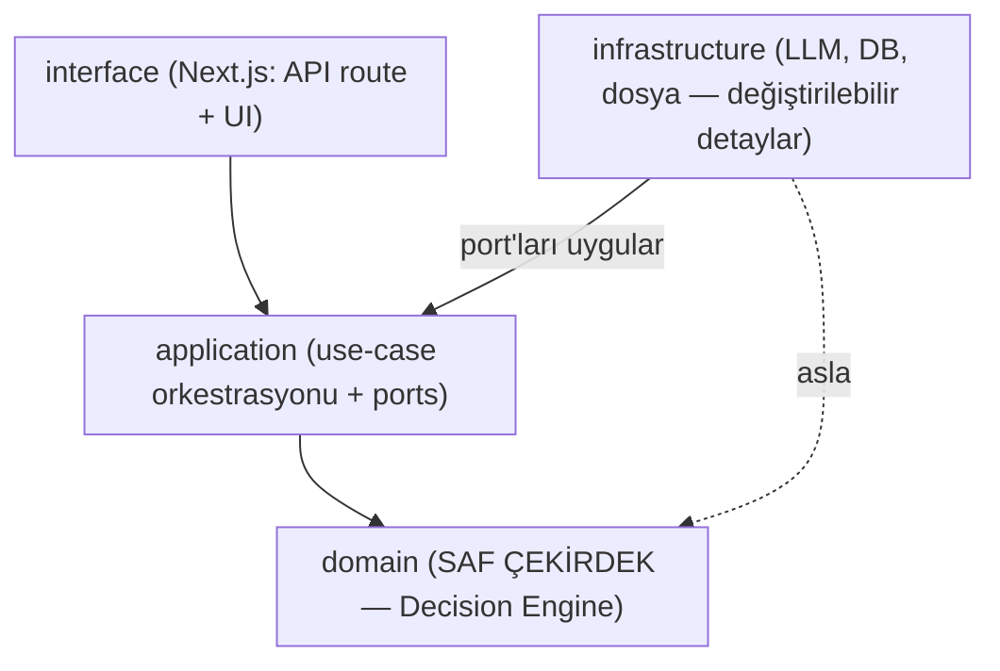
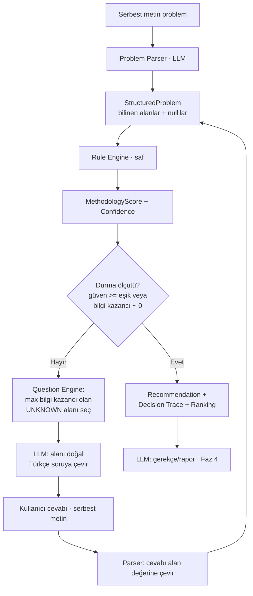

# Mimari — Manufacturing Decision Engine

> Bu doküman projenin **mimari sözleşmesidir**. Kod bu mimariye uyar; mimari koda uymaz.
> Vizyon: `Manufacturing_Decision_Intelligence_Platform.md` · Çalışma planı: `PLAN.md`

## 0. Tek Cümlelik Kimlik

Bu bir **AI chatbot değil**, bir **Manufacturing Decision Engine**'dir:
üretim problemini yapılandırır, belirsizliği ölçer, en fazla bilgi kazandıran soruyu
sorarak belirsizliği azaltır ve **deterministik bir karar motoruyla** doğru metodolojiyi
(gerekçesi ve güven skoruyla) seçer. LLM bu sistemde **beyin değil, çevre birimidir.**

---

## 1. Temel Mimari İlke: Decision-Engine-Centric

Kararı LLM vermez. Kararı `domain` katmanındaki **saf, deterministik, test edilebilir**
karar motoru verir. Bunu mimariye şu kuralla **yapısal olarak** dayatıyoruz:

> **Bağımlılık yönü her zaman içeriye, çekirdeğe doğrudur.**
> `domain` hiçbir şeye bağımlı değildir — ne LLM'e, ne veritabanına, ne Next.js'e.
> LLM ve DB birer "detaydır" ve dışarıdaki `infrastructure` katmanında, arayüzler
> (port) üzerinden takılır. Yani LLM'i tamamen sökmek (`AI_PROVIDER=none`), karar
> motorunu bozmaz — sadece doğal dil anlama ve rapor yazma yeteneğini kaybederiz.



Bu ilkenin pratik sonucu: karar mantığının tamamı LLM olmadan, milisaniyede,
**golden-case testleriyle** doğrulanabilir. Bu, projenin en değerli mühendislik varlığıdır.

---

## 2. Katmanlar ve Klasör Yapısı

```
src/
  domain/                       # SAF: framework/LLM/DB bağımsız. %100 unit-test.
    diagnosis/
      features.ts               # DiagnosticFeature kataloğu + StructuredProblem tipi
      methodologies.ts          # Methodology enum + statik metadata
      rules.ts                  # DEKLARATİF kural seti (feature -> skor katkısı)
      rule-engine.ts            # kuralları çalıştırır -> MethodologyScore[]
      confidence-engine.ts      # skor -> normalize güven dağılımı (softmax)
      question-engine.ts        # bilgi kazancı ile SIRADAKİ soruyu (feature) seçer
      decision-trace.ts         # kararın nedenini zincir olarak üretir
      diagnose.ts               # domain fasadı: classify() / nextQuestion() / trace()
      diagnose.test.ts          # golden-case regresyon testleri
    access/                     # SAF kiracılık kuralları (bkz. §16)
      ownership.ts              # canReadRecord / canWriteRecord / ownershipQuery
      ownership.test.ts         # rol × sahiplik golden-case matrisi
  application/                  # use-case orkestrasyonu (domain'i LLM/DB ile birleştirir)
    diagnosis-service.ts        # parse -> classify -> soru -> cevap döngüsü
    report-service.ts           # (Faz 4) decision trace + knowledge -> LLM raporu
    ports/                      # DIŞ dünyanın SÖZLEŞMELERİ (dependency inversion)
      ai-provider.ts            # IAIProvider (mevcut ai.ts buraya evrilir)
      problem-parser.ts         # IProblemParser: serbest metin -> StructuredProblem
      conversation-repository.ts# IConversationRepository
      knowledge-repository.ts   # IKnowledgeRepository
  infrastructure/               # port'ların SOMUT uygulamaları — takılıp çıkarılır
    ai/
      ollama-provider.ts        # IAIProvider (varsayılan)
      none-provider.ts          # IAIProvider (LLM'siz)
      provider-factory.ts
    parser/
      llm-problem-parser.ts     # IProblemParser: LLM + katı zod şeması ile çıkarım
    persistence/
      prisma.ts
      conversation-repository.prisma.ts
    storage/                    # ek dosya BAYTLARI (IAttachmentStorage)
      local-disk-attachment-storage.ts   # tek makine (varsayılan)
      prisma-attachment-storage.ts       # Postgres bytea — serverless/çok örnekli
      storage-factory.ts                 # ATTACHMENT_STORAGE=disk|postgres
    knowledge/
      file-knowledge-repository.ts  # knowledge/*.md okur
  app/                          # Next.js arayüz katmanı (ince)
    api/diagnosis/route.ts      # POST başlat
    api/diagnosis/[id]/route.ts # GET durum
    api/diagnosis/[id]/answer/route.ts # POST cevap
    (sayfalar)
  lib/
    validation.ts               # ortak zod şemaları
knowledge/                      # metodoloji bilgi tabanı (insan + ileride RAG/rapor)
  RCA.md 8D.md FMEA.md DMAIC.md KepnerTregoe.md PDCA.md A3.md
prisma/schema.prisma
```

**Not:** Mevcut `src/lib/ai.ts` sağlayıcı-bağımsız yapısıyla zaten doğru yolda;
`application/ports/ai-provider.ts` (arayüz) + `infrastructure/ai/*` (uygulama) olarak
ikiye ayrılacak.

---

## 3. Teşhis Akışı (Adaptive Diagnosis Loop)



Bu döngünün özü: **her turda belirsizlik ölçülür ve azaltılır.** Sistem rastgele
soru sormaz; her soru dağılımın entropisini en çok düşürecek soru olur — teşhis
yapan bir doktor gibi.

---

## 4. Domain Modeli

### 4.1 DiagnosticFeature Kataloğu

Karar motorunun akıl yürüttüğü değişkenler. Her biri `true | false | null` (null = bilinmiyor).
Bu katalog projenin **ortak dilidir (ubiquitous language)**.

| key | Anlam / soru teması | Ana metodoloji sinyali |
|-----|---------------------|------------------------|
| `defectOccurred` | Gerçek bir hata/kusur oluştu mu, yoksa sadece risk mi? | false → FMEA |
| `customerAffected` | Müşteri etkilendi mi? | true → 8D |
| `rootCauseKnown` | Kök neden biliniyor mu? | false → RCA |
| `startedRecently` | Problem yeni mi başladı? | true → Kepner-Tregoe |
| `previouslyOccurred` | Daha önce yaşandı mı (tekrar eden)? | true → RCA / false → KT |
| `processChanged` | Süreç yakın zamanda değişti mi? | KT / RCA |
| `operatorChanged` | Operatör değişti mi? | KT / RCA |
| `supplierChanged` | Tedarikçi değişti mi? | KT / RCA |
| `hasMeasurementData` | Ölçüm/veri var mı? | true → DMAIC |
| `highVariation` | Varyasyon yüksek/sürekli mi? | true → DMAIC |
| `isImprovementInitiative` | Akut problem değil, iyileştirme çabası mı? | true → PDCA/A3 |

Türetilmiş: `anyChange = processChanged || operatorChanged || supplierChanged`.

Serbest metin bağlam alanları (karar için değil, rapor/görüntüleme için):
`processName`, `problemDescription`.

### 4.2 StructuredProblem (Parser çıktısı)

```ts
type Ternary = true | false | null;

interface StructuredProblem {
  processName: string | null;
  problemDescription: string | null;
  features: Record<DiagnosticFeatureKey, Ternary>; // hepsi başta null
}
```

**İlke: Parser asla uydurmaz.** Metinde açıkça yoksa değer `null` kalır ve bu alan
otomatik olarak bir soruya dönüşür. Bu, LLM halüsinasyonunu karar dışında tutar.

### 4.3 Methodology

`FMEA | KEPNER_TREGOE | RCA | EIGHT_D | PDCA_A3 | DMAIC` (mevcut Prisma enum ile aynı),
her birine statik metadata: kod, ad, kısa açıklama, `knowledgeFile`.

---

## 5. Rule Engine (kararın sahibi)

Kurallar **deklaratiftir**: her kural bir koşul + bir veya daha çok metodolojiye
ağırlıklı skor katkısıdır. Kod (`rules.ts`) tek doğruluk kaynağıdır.

```ts
type Weight = 1 | 2 | 3; // zayıf | orta | güçlü
interface Rule {
  id: string;
  when: (p: StructuredProblem) => boolean; // yalnızca BİLİNEN alanlara bakar
  effect: Partial<Record<Methodology, number>>; // + destekler, - cezalandırır
  because: string; // decision trace için insan-okur gerekçe
}
```

İllüstratif kural seti (ağırlıklar **konfigürasyondur**, ileride kalibre edilecek):

| Kural | Koşul | Etki |
|------|-------|------|
| R1 | `defectOccurred == false` | FMEA +3, RCA −2, 8D −2 |
| R2 | `defectOccurred == true` | RCA +1, 8D +1, FMEA −2 |
| R3 | `customerAffected == true` | 8D +3, RCA +1 |
| R4 | `customerAffected == false` | 8D −2 |
| R5 | `rootCauseKnown == false` | RCA +2, 8D +1 |
| R6 | `rootCauseKnown == true` | RCA −2 |
| R7 | `startedRecently && anyChange` | KT +3 |
| R8 | `previouslyOccurred == true` | RCA +2, KT −1 |
| R9 | `hasMeasurementData && highVariation` | DMAIC +3 |
| R10 | `highVariation == true` | DMAIC +2 |
| R11 | `isImprovementInitiative == true` | PDCA_A3 +3 |

`RuleEngine.evaluate(p)` → `{ scores: Record<Methodology, number>, firings: RuleFiring[] }`.
`firings`, decision trace ve bilgi kazancı hesabı için kullanılır. Kurallar yalnızca
**bilinen** alanlara bakar; `null` alanlar hiçbir kuralı tetiklemez (bu yüzden onları sorarız).

---

## 6. Confidence Engine

Skorları güven dağılımına çevirir. Negatif skorları da doğal işleyen **softmax**:

```
confidence_i = exp(score_i / T) / Σ_j exp(score_j / T)
```

`T` (sıcaklık) bir tasarım düğmesidir: küçük T → keskin/kararlı dağılım, büyük T → temkinli.
Çıktı, tüm metodolojiler için sıralı `{ methodology, score, confidence }[]` (örn. RCA %87,
KT %72, DMAIC %15, FMEA %4).

> **Mühendislik uyarısı — kalibrasyon:** Bu yüzdeler başta *göreli güven*tir, gerçek
> olasılık değil. Faz 6'da saklanan konuşmalar (Conversation Model) etiketli veri
> hâline gelince ağırlıkları/T'yi kalibre edeceğiz. Kullanıcıya "göreli uygunluk"
> olarak sunulur, mutlak doğruluk iddiası edilmez.

---

## 7. Adaptive Question Engine (bilgi kazancı)

Amaç: **en az soruyla en çok belirsizlik azaltmak.** Chatbot değil, teşhis.

**Belirsizlik ölçüsü:** güven dağılımının Shannon entropisi `H = −Σ p_i log p_i`.

**Sıradaki soru seçimi** — her `null` (bilinmeyen) alan `f` için beklenen bilgi kazancı:

```
IG(f) = H(mevcut)  −  [ P(f=true)·H(f=true iken) + P(f=false)·H(f=false iken) ]
```

- `P(f=true/false)`: başlangıçta 0.5/0.5 (ileride alan taban oranlarıyla iyileştirilir).
- `H(f=true iken)`: `f`'yi true varsayıp yeniden sınıflandırıp entropiyi hesapla.
- **Seçim:** en yüksek `IG` veren alanı sor.

**İlgi kapısı (relevance gate):** Yalnızca en az bir kuralda geçen ve mevcut lider
hipotezleri değiştirebilecek alanlar aday olur — alakasız soru sorulmaz.

**Durma politikası** (herhangi biri sağlanınca sorgu biter):
- lider güven ≥ `τ_conf` (örn. 0.85), **veya**
- lider ile ikinci arasındaki fark ≥ `τ_margin`, **veya**
- `max IG < ε` (soru artık bilgi katmıyor), **veya**
- sorulan soru sayısı ≥ `Q_max`, **veya**
- bilinmeyen alan kalmadı.

Bu politika, sistemin "yeterince eminim" diyip durabilmesini sağlar — bir doktorun
gereksiz tetkik istememesi gibi.

---

## 8. Decision Trace

Karar **deterministik üretildiği için** izi de otomatik üretilir. `RuleFiring`
kayıtlarından, kazanan metodolojiye en çok katkı yapan alanlar sırayla zincire dizilir:

```
Problem yeni başladı  →  Müşteri etkilenmedi  →  Kök neden bilinmiyor
   →  Süreç değişmiş  →  Bu nedenle: RCA (Güven %87)
```

Yapı:

```ts
interface DecisionTrace {
  steps: { feature: DiagnosticFeatureKey; value: boolean; because: string }[];
  conclusion: { methodology: Methodology; confidence: number };
}
```

Bu zincir sistem tarafından üretilir; LLM (Faz 4) onu yalnızca akıcı Türkçe metne
çevirebilir ama zincirin **kaynağı domain'dir**, LLM değil.

---

## 9. Problem Parser (LLM'in birinci görevi)

Serbest metni `StructuredProblem`'e çeviren `IProblemParser`. LLM uygulaması
(`llm-problem-parser.ts`) şu disiplinlere uyar:

- **Katı çıktı sözleşmesi:** sadece kataloğdaki alanlar; her biri `true|false|null`.
  Çıktı **zod** ile doğrulanır; şemaya uymayan alan atılır.
- **Düşük sıcaklık**, çıkarım görevi olduğu için.
- **Uydurma yasak:** metinde delil yoksa `null`. (null = "sonra sor".)
- Aynı parser iki yerde çalışır: (a) ilk intake, (b) her kullanıcı cevabını ilgili
  alan değerine çevirmek. Böylece kullanıcı "hayır etkilenmedi" derse
  `customerAffected=false` olur.

Böylece LLM'in tek karar-dışı sorumluluğu **anlama**dır; halüsinasyon yüzeyi
sınıflandırmadan tamamen ayrışır.

---

## 10. AI Provider Bağımsızlığı

`IAIProvider` (application/ports) korunur — mevcut `ai.ts`'in evrimi:

```ts
interface IAIProvider {
  readonly name: string;
  readonly available: boolean;
  complete(p: { system?: string; prompt: string; maxTokens?: number }): Promise<string>;
}
```

- Varsayılan: `OllamaProvider` (yerel, ücretsiz). Ayrıca `NoneProvider`.
- İleride `GeminiProvider`, `ClaudeProvider`, `OpenAIProvider` yalnızca birer
  `infrastructure/ai/*` dosyasıdır; domain/application değişmez.
- Provider "aptaldır": metin girer, metin çıkar. Parsing/soru-yazma/rapor promptları
  provider'da değil, application/infrastructure servislerinde yaşar.

---

## 11. Knowledge Layer

`knowledge/*.md` — her metodoloji için tek dosya. İlk aşamada **yalnızca yapı ve
tutarlı şablon**; RAG ve LLM rapor üretimi Faz 4/6'da bunu tüketir.

Şablon (makine-okur frontmatter + insan-okur gövde):

```markdown
---
code: RCA
name: Root Cause Analysis
whenToUse: Kalıcı bir hata var ve kök neden bilinmiyor.
signals: [rootCauseKnown=false, defectOccurred=true]
tools: [5 Why, Balık Kılçığı, Fault Tree]
phases: [Tanım, Kanıt toplama, Kök neden, Doğrulama, Önlem]
---
# ... insan-okur içerik, ileride genişletilecek ...
```

> **Tek doğruluk kaynağı ayrımı:** Karar mantığı **koddaki** `rules.ts`'te yaşar.
> `knowledge/*.md`'deki `signals` yalnızca **belgeleme/aynadır** — insanlar ve ileride
> LLM raporu içindir, karar motoru bunları okumaz. İki yerde karar mantığı tutmayız.

---

## 12. Persistence / Conversation Model

Öğrenme sistemine (Faz 6) zemin olacak şekilde konuşma ve her turdaki durum saklanır.

```
Problem 1─┐
          └─* Conversation ─* Message
                    │
                    ├─* ProblemSnapshot   (her tur: StructuredProblem + ranking)
                    └─1 DiagnosisResult   (chosen + ranking + decisionTrace)
```

Yeni/gözden geçirilmiş Prisma modelleri (özet):

- **Conversation** — `problemId`, `status`, `structuredProblem: Json` (güncel anlık görüntü), zaman damgaları.
- **Message** — `conversationId`, `role` (USER/ASSISTANT/SYSTEM), `kind` (FREE_TEXT/QUESTION/ANSWER/REPORT), `content`, `featureKey?` (soru/cevap hangi alanı hedefliyor).
- **ProblemSnapshot** — `conversationId`, `turn`, `structuredProblem: Json`, `ranking: Json`. (Replay + öğrenme için turluk iz.)
- **DiagnosisResult** — `conversationId` (unique), `chosenMethodology`, `confidence`, `ranking: Json`, `decisionTrace: Json`.

`StructuredProblem`, `ranking`, `decisionTrace` gibi hızla evrilecek yapılar `Json`
(Postgres `jsonb`) olarak tutulur; uygulama sınırında **zod** ile tiplenir. Metodoloji
çalışma alanı tabloları (RcaAnalysis vb.) önceki plandaki gibi korunur (Faz 5).

---

## 13. API Tasarımı

İnce route handler'lar; iş `application/diagnosis-service.ts`'te.

| Metot | Yol | Görev |
|-------|-----|------|
| `POST` | `/api/diagnosis` | Başlat. Body `{ text }`. Parse+classify. Döner: durum + (soru \| sonuç). |
| `POST` | `/api/diagnosis/{id}/answer` | Cevap. Body `{ text }`. Parse+reclassify. Döner: sıradaki soru \| sonuç. |
| `GET`  | `/api/diagnosis/{id}` | Konuşma + güncel durumu getir. |
| `POST` | `/api/diagnosis/{id}/report` | (Faz 4) Decision trace + knowledge → LLM raporu. |

Ortak yanıt DTO'su (zod ile doğrulanır):

```ts
interface DiagnosisState {
  conversationId: string;
  structuredProblem: StructuredProblem;
  ranking: { methodology: Methodology; confidence: number }[];
  status: "ASKING" | "CONCLUDED";
  nextQuestion?: { featureKey: DiagnosticFeatureKey; text: string };
  result?: { methodology: Methodology; confidence: number; trace: DecisionTrace };
}
```

---

## 14. Test Stratejisi (mimarinin garantisi)

Domain saf ve deterministik olduğu için **golden-case regresyon suiti** kurulur:
etiketli problem senaryoları → beklenen metodoloji + makul güven aralığı.

```
"müşteri şikayeti geldi, kök neden bilinmiyor"        => EIGHT_D
"hat yeni kuruldu, henüz hata yok ama risk var"        => FMEA
"iki haftadır çatlak, süreç geçen ay değişti"          => KT
"ölçümlerde varyasyon sürekli yüksek"                  => DMAIC
```

Bu suit hem doğruluk güvencesi, hem de kural ağırlıklarını kalibre ederken
regresyon kalkanıdır. LLM olmadan, saniyeler içinde koşar.

---

## 15. Revize Yol Haritası

| Faz | İçerik | LLM gerekir mi? |
|-----|--------|-----------------|
| **1** | **Domain çekirdeği**: features, rules, rule-engine, confidence-engine, question-engine, decision-trace + golden-case testleri | **Hayır** |
| **2** | Problem Parser (Ollama) + adaptive loop orkestrasyonu + Conversation persistence | Evet |
| **3** | UI: problem girişi, soru-cevap akışı, sonuç + decision trace görselleştirme | Hayır |
| **4** | Knowledge layer tüketimi + LLM rapor üretimi | Evet |
| **5** | Metodoloji çalışma alanı (önce RCA modülü) | Kısmi |
| **6** | Öğrenme: saklanan konuşmalardan ağırlık kalibrasyonu + RAG | Evet |

**Kritik sıralama kararı:** Önce Faz 1 (saf karar motoru + testler), *sonra* LLM.
Bu, "LLM merkezli değil, Decision-Engine merkezli" ilkesinin somut uygulamasıdır —
sistemin kalbi, hiçbir LLM olmadan çalışır ve kanıtlanır.

---

## 16. Hesap ve Kiracılık (SaaS'a evrilme)

> **Kapsam değişikliği — bilinçli.** Proje tek kiracılı bir iç araç olarak tasarlandı.
> Ürün büyüdükçe **çok kiracılı bir SaaS'a evriliyor**: bireysel ve şirket hesapları,
> roller, davet ve e-posta doğrulama akışları. Bu bölüm o katmanın sözleşmesidir.
> Tek-kiracılı mod kaldırılmadı: hesap sistemi `ACCOUNT_AUTH_ENABLED=1` ile açılan
> bir katmandır ve kapalıyken uygulama eskisi gibi (hatta auth'suz) çalışır.

### 16.1 Üç auth modu

| Mod | Anahtar | Davranış |
|-----|---------|----------|
| Kapalı | (yok) | Auth yok — out-of-box kurulum. |
| Tek parola | `APP_PASSWORD` | Tek kiracılı iç araç; oturum çerezi HMAC(APP_PASSWORD). |
| Hesap sistemi | `ACCOUNT_AUTH_ENABLED=1` | Çok kiracılı; oturum DB'de, token'ın sha256'sı saklanır. |

### 16.2 İlke: kiracılık kuralı da domain'dedir

Karar mantığı için geçerli olan ilke erişim kararı için de geçerlidir: **kural saf
çekirdekte yaşar, altyapıda değil.** `src/domain/access/ownership.ts` yalnız iki şey
alır — çözümlenmiş kimlik (`AccessIdentity`) ve kaydın sahiplik alanları
(`RecordOwner`) — ve bir boolean döndürür. DB, Prisma, çerez, Next bilmez.

```ts
canReadRecord(identity, record): boolean
canWriteRecord(identity, record): boolean   // VIEWER daima false
ownershipQuery(identity): OwnershipQuery    // liste ekranlarının WHERE'i
```

`src/lib/account-auth.ts` bu kuralın **uygulayıcısıdır, sahibi değil**: kaydı
Postgres'ten okur, kararı domain'e sorar. Kuralın ikinci bir kopyası hiçbir route
veya sayfada tutulmaz.

### 16.3 Rol matrisi

| Kimlik | Görebildiği kayıtlar | Yazma |
|--------|----------------------|-------|
| Bireysel hesap | Yalnız kendi **kişisel** kaydı (`organizationId = null`) | Evet |
| `OWNER` / `ADMIN` / `MANAGER` | Şirketin tüm kayıtları | Evet |
| `MEMBER` | Şirket içinde yalnız kendi oluşturduğu | Evet |
| `VIEWER` | Şirketin tüm kayıtları | **Hayır** (salt-okunur) |
| Herkes | Sahipsiz kayıt (`ownerUserId` ve `organizationId` null) **görünmez** | — |

Kritik kenar durum: **şirket kaydı, aynı kullanıcının bireysel hesabına sızmaz.**
Üyelik düşerse (ör. şirket pasifleştirilir) hesap bireysele döner; kendi oluşturduğu
şirket kayıtları ona **geri açılmaz**. Veri şirkette kalır.

`ownership.test.ts` bu matrisi golden-case suiti olarak sabitler ve ayrıca
`ownershipQuery` ile `canReadRecord`'un **aynı sonucu verdiğini** doğrular — liste
ekranı ile tekil erişim ayrışırsa test kırılır.

### 16.4 Sahiplik oluşturmanın parçasıdır

Repository portları sahipliği `create`'in ikinci argümanı olarak alır:

```ts
create(seed, owner?: RecordOwner): Promise<T>
```

Kayıt ve sahibi **tek yazımda** kalıcılaşır. Önceki tasarımda route katmanı kaydı
oluşturup sahipliği ikinci bir `prisma.update` ile yazıyordu; araya giren bir hata,
hiçbir hesaba bağlı olmayan — ve bu yüzden kimseye görünmeyen — kalıcı bir kayıt
bırakıyordu. Ayrıca bu desen route'u Prisma'ya bağımlı kılarak katman sözleşmesini
deliyordu.

### 16.5 Kalıcılık kısıtı

Sahiplik sütunları (`ownerUserId`, `organizationId`) yalnız Postgres modellerinde
vardır. Bu yüzden `ACCOUNT_AUTH_ENABLED=1` **`PERSISTENCE=prisma` gerektirir**;
bellek kalıcılığıyla birleştirilirse composition root açık bir hata fırlatır
(sessizce sahipsiz kayıt üretmek yerine).

### 16.6 Hesap akışlarının karar kuralları

Erişim gibi, hesap akışlarının kararları da domain'dedir
(`src/domain/access/account-policy.ts`) ve `account-policy.test.ts` ile korunur:

| Kural | Karar |
|-------|-------|
| `loginDecision` | Olmayan hesap, pasif hesap ve yanlış parola **ayırt edilemez** (`INVALID_CREDENTIALS`); doğrulanmamış e-posta ancak parola doğruyken bildirilir. |
| `credentialTokenUsable` | Tür eşleşmeli + kullanılmamış + süresi dolmamış. Jeton başka amaç için kullanılamaz. |
| `TOKEN_TTL_HOURS` | Doğrulama 24s · parola yenileme 1s · davet 72s. |
| `seatAvailable` / `seatLimitReducible` | Davet koltuk rezerve eder; sınır kullanılanın altına indirilemez. |
| `invitationAcceptable` | Davet yalnız `INVITED` üyelik için kabul edilir. |
| `membershipMutable` | `OWNER` üyeliği değiştirilemez/silinemez — şirket sahipsiz kalamaz. |

### 16.7 Hesap akışlarının katmanlanması

Kiracılık katmanı artık teşhis çekirdeğiyle aynı deseni izler:

```
route (ince: HTTP, çerez, hız sınırı)
  → AccountService (akış orkestrasyonu)
      → domain/access (KARAR: giriş, jeton, koltuk, davet)
      → IAccountRepository / IPasswordHasher / IEmailSender (I/O)
```

- **Servis HTTP bilmez.** Oturumu servis açar ve ham jetonu döndürür; çereze
  yazmak route'un işidir (`setSessionCookie`). Böylece akışlar `next/headers`
  olmadan test edilebilir.
- **Parola özetleyici ayrı bir porttur.** Gerçek scrypt bilinçli olarak ~0,5 sn
  sürer; akış testleri hızlı bir sahte uygulama takar.
- **`account-service.test.ts`** kayıt, doğrulama, giriş, parola yenileme,
  oturum içi parola değişimi ve davet akışlarını bellek içi depo ile uçtan uca
  koşar — Postgres ve e-posta sağlayıcısı olmadan.
- Oturum çözümlemesi tek yerdedir (`resolveSession`): süre dolması, **pasif
  kullanıcı** ve aktif üyelik seçimi kuralları hem Prisma hem bellek
  uygulamasında aynıdır.

### 16.8 Misafir, yerel kayıt ve hesaba taşıma

Üyeliksiz kullanım ayrı ve açık bir veri sınırıdır:

```text
/api/guest/diagnosis (durumsuz istek)
  → TransientConversationRepository (yalnız istek ömrü)
  → teşhis görünümü + istemciye dönen devam durumu
  → IndexedDB (kullanıcının tarayıcısı)
```

- Misafir teşhisi sunucudaki `ConversationRecord` veya `WorkspaceRecord`
  tablolarına yazılmaz. Devam durumu her istekte istemciden gelir ve geçici depo
  istek sona erdiğinde atılır.
- Teşhisler, uygulama alanları ve desteklenen ek dosyalar sürümlü IndexedDB
  şemasında tutulur. Arayüz bu depoya yalnız `guest-storage.ts` veri kapısı
  üzerinden erişir.
- Yerel çalışma kimlikleri `local_ws_` öneki taşır; ortak çalışma arayüzü bu
  kimlikleri sunucu API'sine göndermeden yerel depodan açar ve kaydeder.
- Üyelik açılması otomatik aktarım başlatmaz. Kullanıcı hesabında yerel kayıtları
  seçer ve açıkça aktarır.
- `/api/account/local-workspaces` sahipliği istemciden kabul etmez; oturumdan
  türetir. `specialty.localOriginId` doğal anahtarı aynı yerel çalışmanın yeniden
  denenmesinde ikinci bir bulut kaydı oluşmasını engeller.
- Ek dosya baytları çalışma JSON'una gömülmez. Ana kayıt başarıyla oluşturulduktan
  sonra korumalı ek dosya ucuna ayrı ayrı yüklenir. Başarısız aktarım yerel
  kopyayı silmez; tekrar deneme güvenlidir.

Bu sınırın amacı yalnız deneme kolaylığı değildir: kullanıcıya verinin nerede
tutulduğunu doğru söylemek, üyelik baskısını azaltmak ve anonim verinin fark
edilmeden kurumsal veritabanına karışmasını önlemektir.

### 16.9 Kalan borç

- Sayfaların okuma modelleri (`/hesabim`, `/sirket`, `/admin`) ve `/api/health`
  hâlâ doğrudan Prisma okur. Bunlar yazma yapmayan görüntüleme sorgularıdır;
  bir okuma-modeli portu ileride eklenebilir.
- `lib/account-auth.ts` çalışma kaydı erişim kontrollerinde (workspace/rca/
  conversation) doğrudan Prisma okur — kural domain'de, sorgu burada.
- Hız sınırlayıcı süreç-içidir; yatay ölçekte paylaşımlı depoya taşınmalıdır (bkz. §17).
- Süresi geçmiş `UserSession` ve `CredentialToken` kayıtları için süpürme işi yok.

---

## 17. Açık Kararlar ve Riskler

- **Kural ağırlıkları el ile belirleniyor (prior).** Risk: öznel. Azaltma: golden-case
  suiti + Faz 6 kalibrasyonu; ağırlıklar konfigürasyon olarak tutulur, koda gömülmez.
- **Güven yüzdeleri kalibre değil.** Kullanıcıya "göreli uygunluk" olarak sunulur.
- **Parser hatası** yanlış alan değeri üretebilir. Azaltma: katı zod şeması, düşük
  sıcaklık, uydurma yasağı (null tercih), ve kullanıcı cevaplarında onay/isteğe bağlı düzeltme.
- **8D ⊃ RCA örtüşmesi.** 8D esasen RCA + containment + müşteri raporudur; ayırt edici
  alan `customerAffected`. Kural seti bunu yansıtır; golden-case ile korunur.
- **Yerel LLM Türkçe kalitesi.** `qwen2.5:7b` / `llama3.1:8b` denenip parser doğruluğu
  golden metinlerle ölçülecek.
```
